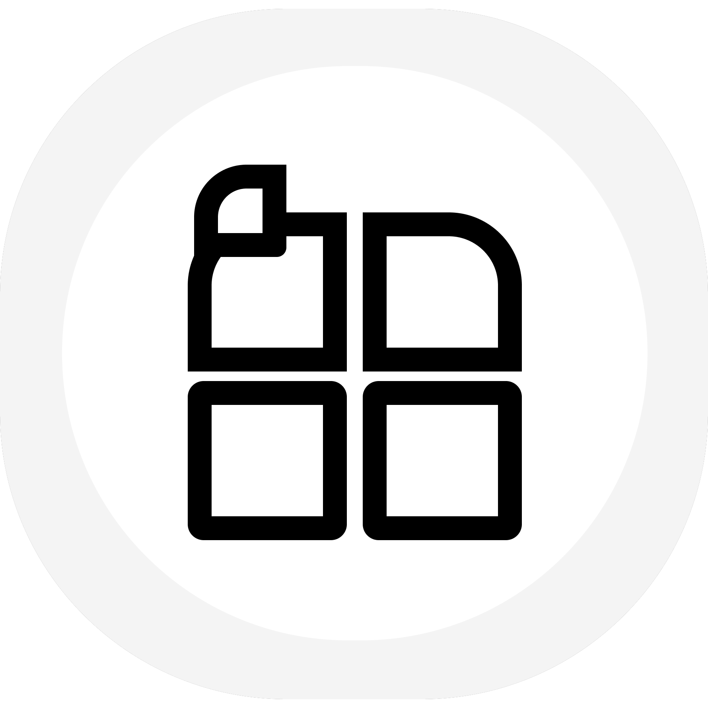

# Quire

A reader for the documents you are actually sent. It opens PDF, Word,
spreadsheets, PowerPoint decks, CSV and Markdown, and it treats every one of
them as a document rather than as a file it happens to be able to display.
The Office formats are the zipped ones (.docx, .xlsx, .pptx); the older .doc,
.xls and .ppt binaries are not read yet.

## What it does that other readers do not

**A sheet has two sides.** Turn a corner and the back of the page carries that
page's own words, extracted and set for reading. Nothing you uncover is ever
blank.

**You can sign a PDF and the signature is really in the file.** Draw the mark or
bring a picture of one, put it where you want it on the page, size it there, and
what comes out is a PDF that opens signed in any other reader. The mark snaps to
the page's own lines of type rather than to a grid laid over them.

**It converts what it reads.** Plain text and Markdown from anything, CSV and a
spreadsheet from anything with a grid, a Word file from anything without one,
and a PDF set fresh in the app's own typeface. Every conversion says what it
will cost before you pick it, because every conversion loses something.

**A PDF looks like its print.** Pages are drawn by the phone's own PDF
renderer, in the file's own fonts, while quire's engine reads every page
underneath for search, the back of the sheet and signing. A document whose
fonts read badly can be set in quire's own type instead, from View.

**It reads a page file's shape, not just its words.** A PDF states where its
glyphs sit and nothing else. Quire works the rest out from the setting: type
markedly bigger than the body is a heading, a line that fills its column without
finishing its sentence runs into the next, a strip no word crosses is a gutter,
and a line repeated at the same height on most pages is a running head rather
than part of the text.

**A deck is laid on a bench and presented.** Every slide of a .pptx is set at
its own shape, with its speaker notes on the back of the sheet, and present mode
puts the slide alone on the screen with the deck's own titles to jump by.

**A PDF can be sealed with a password,** in the file itself, so it asks for the
password in any other reader too.

**Every format can be edited, and nothing is lost by it.** A Word document is
edited on the page, in its own styles, with a formatting bar that rides on the
keyboard, find and replace, a word count and an outline. A deck is edited as in
Slides: shapes picked up with handles, moved, sized and turned, words typed on
the slide itself, tables, pictures and lines put in, and slides added from the
deck's own layouts, reordered and given a theme. A CSV file is a grid, edited a
cell at a time, and so are a workbook's cells, formulas included. Markdown is
edited as the text it is, with the page it makes a tap away. A PDF takes words,
ink, highlights, strikes and pictures, written as annotations after what is
already in the file, and every mark, quire's own or another program's, can be
picked up again, moved, sized, recoloured or deleted. Only what was edited is
written again; every other part of a file is copied across as it was. Every
save is a new revision kept beside the document, never over it: the file it
arrived as, a shipped sample or one on the phone, is never touched, and
Revisions reads any earlier one again.

**It reads your folders where they are.** Hand quire a folder on the phone,
Downloads to start with, and everything in it that quire reads is on the desk
under ALL, found by the search and opened in place. No permission is asked
for; the phone grants that one folder and nothing else.

**The reading can be fastened down.** Lock the way out, so a hand on the edge of
the screen cannot close the document, or lock the page as well and every bar
leaves the screen.

**Four kinds of bigger.** Pinch and double tap, which set the page again at the
new size rather than magnifying it. Fit the width, the whole page, or actual
size. Reflowing text for documents that have no pages of their own. And a loupe
that follows your finger for the fine print.

Everything stays on the device. There is no account, no sync and no network:
the app does not hold the internet permission, so Android itself refuses it a
connection. The library is kept out of the phone's cloud backup as well.

## Running it

Flutter 3.44 or newer, on Android or iOS:

```
flutter pub get
flutter run
```

The desk opens with a few sample documents. The folder button in the search bar
brings in your own, and Quire also appears in the share sheet and in the list of
apps that can open a document.

## Layout

- `lib/pdf/` the page engine: parser, content interpreter, typesetter, and the
  incremental writer that puts a signature or annotations into an existing
  file
- `lib/edit/` the patchers that change Word, PowerPoint, spreadsheet and text
  files in place, copying every part they do not change byte for byte
- `lib/format/` the Word, spreadsheet, PowerPoint, CSV and Markdown parsers
- `lib/model/` the one document model they all produce, and the search over it
- `lib/screens/` the desk and the reader
- `lib/painting/` everything drawn rather than laid out
- `test/` unit tests for the parsing and the geometry, golden images for the
  screens and for each animation's keyframes. Run the suite with
  `tool/test.sh`, which clears `test/failures/` first so every diff in it
  belongs to the run that made it.
